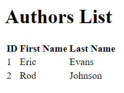

# Spring Boot Exercise | Application Author Controller & Publisher Bootstrap configuration

This repository contains a Spring Boot application that demonstrates the management of authors and publishers using Spring Data JPA and Thymeleaf for the view layer.

## Table of Contents
- [Overview](#overview)
- [Author Service](#author-service)
    - [AuthorService Interface](#authorservice-interface)
    - [AuthorServiceImpl Class](#authorserviceimpl-class)
- [Author Controller](#author-controller)
- [Thymeleaf Template for Authors](#thymeleaf-template-for-authors)
- [Publisher Entity](#publisher-entity)
- [Bootstrap Data Initialization](#bootstrap-data-initialization)

## Overview
This project showcases a simple web application where users can manage authors and publishers. It leverages Spring Boot for easy configuration and setup, Spring Data JPA for database interaction, and Thymeleaf for rendering the user interface.

## Author Service

### AuthorService Interface
The `AuthorService` interface defines a contract for operations related to authors. It declares a method to retrieve all authors from the database.

### AuthorServiceImpl Class
The `AuthorServiceImpl` class is a concrete implementation of the `AuthorService` interface. It uses `AuthorRepository` to fetch data from the database and provides the business logic for author-related operations.

## Author Controller
The `AuthorController` is responsible for handling HTTP requests related to authors. It maps the `/authors` URL to a method that populates the model with a list of authors and returns the view name `authors`, which will be resolved by Thymeleaf.

## Thymeleaf Template for Authors
The Thymeleaf template `authors.html` is used to display a list of authors. It iterates over the list of authors provided by the controller and displays each author's ID, first name, and last name in a table format.

## Publisher Entity
The `Publisher` class represents the publisher entity in the database. It includes fields such as `publisherName`, `address`, `city`, `state`, and `zipCode`. The class also includes a one-to-many relationship with the `Book` entity, allowing a publisher to be associated with multiple books.

## Bootstrap Data Initialization
The `BootstrapData` class implements `CommandLineRunner` to initialize the database with sample data on application startup. It creates and saves sample `Author`, `Book`, and `Publisher` entities and establishes relationships between them.

